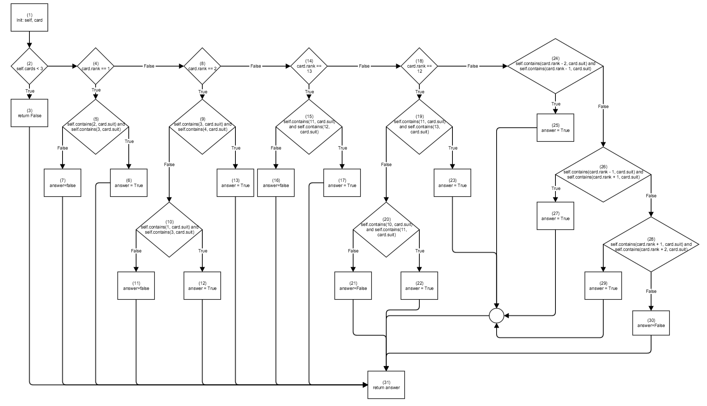
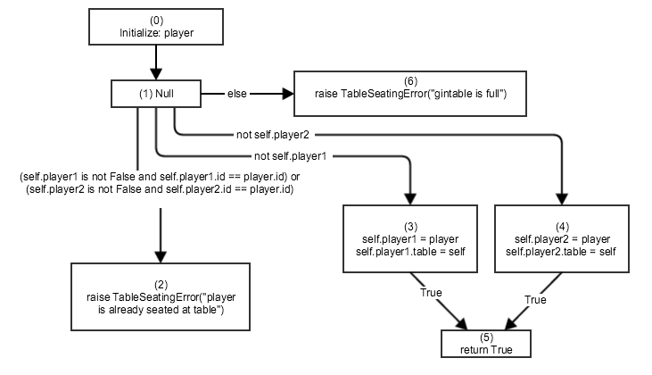

# gin_hand.\_is_in_a_meld
## Control Flow

### All Branch Coverage
| Number | Path | Interpretation | Cards |
|--------|------|----------------|-------|
| 1. | 1-2(F)-3-31 | Less than 3 cards | card_group7 |
| 2. | 1-2(T)-4(T)-5(T)-6-31 | 1 w/ 2 & 3 | 1S, 2S, 3S |
| 3. | 1-2(T)-4(T)-5(F)-7-31 | 1 w/o 2 or 3 | 1C |
| 4. | 1-2(T)-4(F)-8(T)-9(T)-13-31 |  2 w/o 3 & 4 or 1 & 3 | 2D
| 5. | 1-2(T)-4(F)-8(T)-9(F)-10(F)-11-31 | | 2D |
| 6. | 1-2(T)-4(F)-8(T)-9(F)-10(T)-12-31 | | 1S, 2S, 3S|
| 7. | 1-2(T)-4(F)-8(F)-14(T)-15(F)-16-31 | |  K(D)|
| 8. | 1-2(T)-4(F)-8(F)-14(T)-15(T)-17-31 | | K(S), Q(S), J(S)|
| 9. | 1-2(T)-4(F)-8(F)-14(F)-18(T)-19(T)-23-31 | | K(S), Q(S), J(S)|
| 10. | 1-2(T)-4(F)-8(F)-14(F)-18(T)-19(F)-20(T)-22-31 | | 10D, J(D), Q(D)|
| 11. | 1-2(T)-4(F)-8(F)-14(F)-18(T)-19(F)-20(F)-21-31 | | Q(C)|
| 12. | 1-2(T)-4(F)-8(F)-14(F)-18(F)-24(T)-25-31 | |   4H, 3H, 2H |
| 13. | 1-2(T)-4(F)-8(F)-14(F)-18(F)-24(F)-26(T)-27-31 | |  4H, 3H, 2H |
| 14. | 1-2(T)-4(F)-8(F)-14(F)-18(F)-24(F)-26(F)-28(F)-29-31 | | 4H, 3H, 2H |
| 15. | 1-2(T)-4(F)-8(F)-14(F)-18(F)-24(F)-26(F)-28(T)-30-31 | | 4H, 3H, 2H |

## Data Flow Model

## All uses of player
0-1-2

0-1-3-5

0-1-4-5
